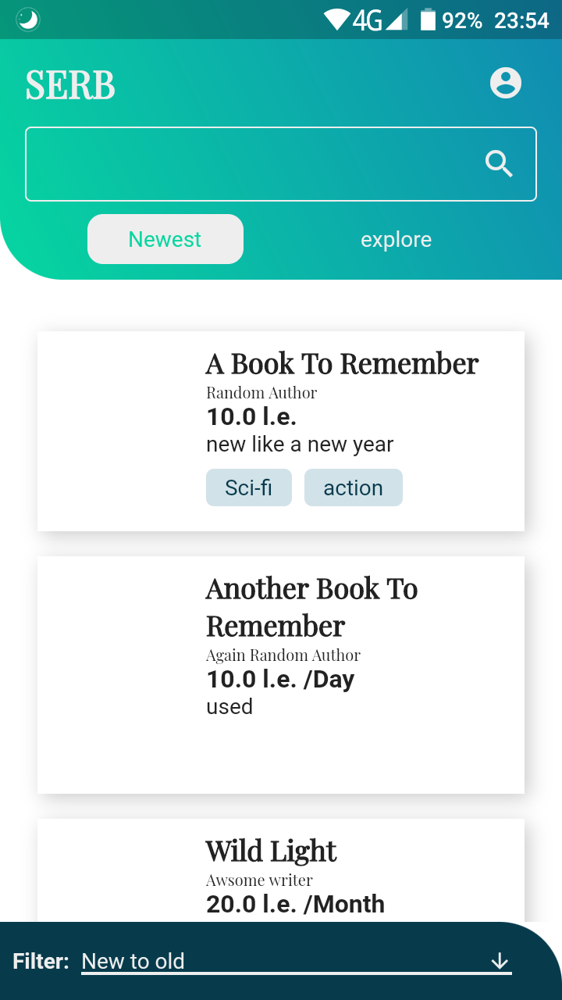
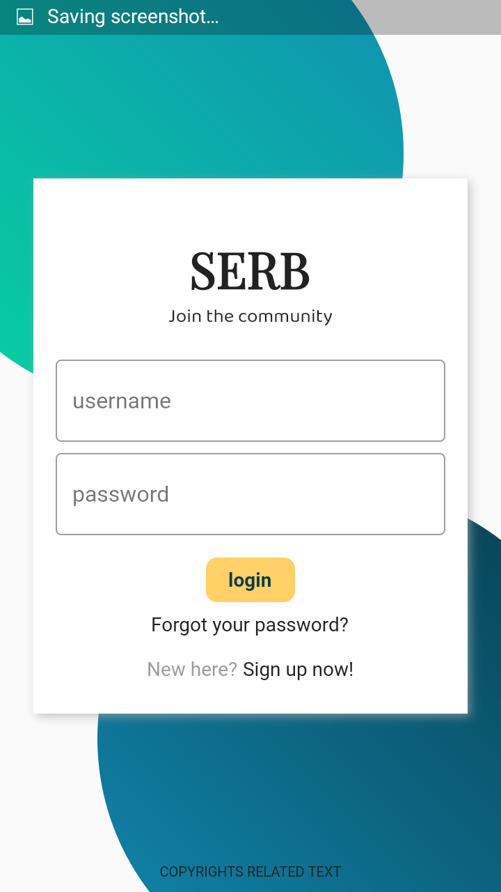
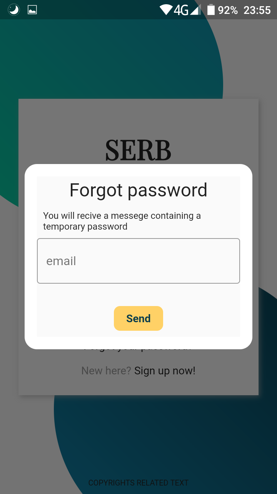
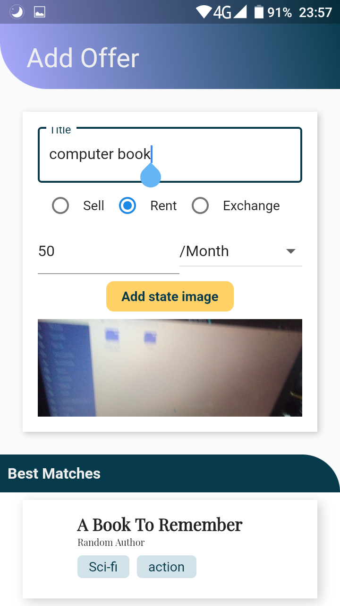

# Serb Client
Client for Serb application
## Screenshots





## testing
This is just a client with no business or persistence logic if you still want to try it download the app from releases *alpha releases*

For web you can use any simple server to run for example Python's `http.server`

```bash
> cd path/to/web/build
> python -m http.server <port number>
```
